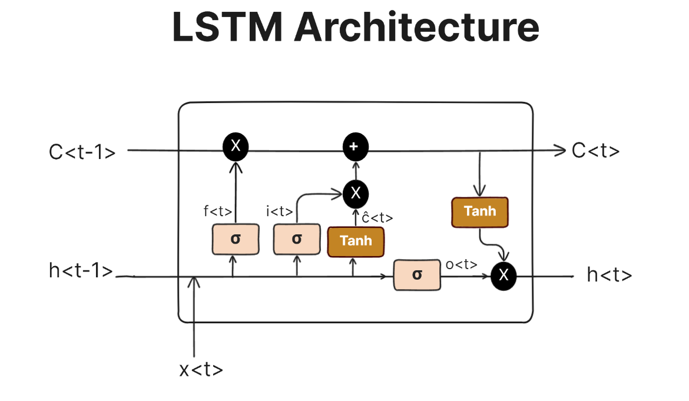

Writing in typescript is just... bland... It has neither intrigued me nor bored me. As someone who knew how to code in
javascript prior, I still can't grasp how much better this subset of js is to justify the language being created. Maybe I
still don't understand how typescript truly works. 

## WAIT, HEAR ME OUT

Now before the web developers come after me, my interest lies more in data science and Machine Learning so my opinion is biased. When I think of Python, the syntax is very easy to understand, the community is larger so it's easier to get help, the best libraries on ML is published on Python, and the list goes on. On the other hand, Typescript is just... typescript. On a good note, typescript is not entirely bad in terms of it can help create a website for my AI tool! I can deploy my model on the website; this way, it'll be way easier to gain users. With that being said, this rating of average is actually on the higher end all things considered, I appreciate typescript for what it can do for my ML projects!!

## It's actually not that bad...

Setting aside my opinions on typescript, I actually do think that the WODs are useful. It helps us think critically 
especially because of the timer and the increasing complexity per new WOD. My only "complaint" is the fact that we can use
unlimited AI. I've noticed that some people are finishing these WODs in 5 minutes which is hard to believe unless they 
are blatantly copying and pasting. Obviously, it's not my interest in whether other individuals learn or not but I thought I mentioned this.

## WE MUST ADAPT

I also would like to share my opinion that the syllabus should be changed soon. Typescript and other languages and frameworks (especially frontend)  will be replaced by AI very soon. We must adapt to this evolving field and I believe that learning how to use AI API's or learning how to implement any AI tool into a software product will be very useful for us students. I hope this will be considered.

