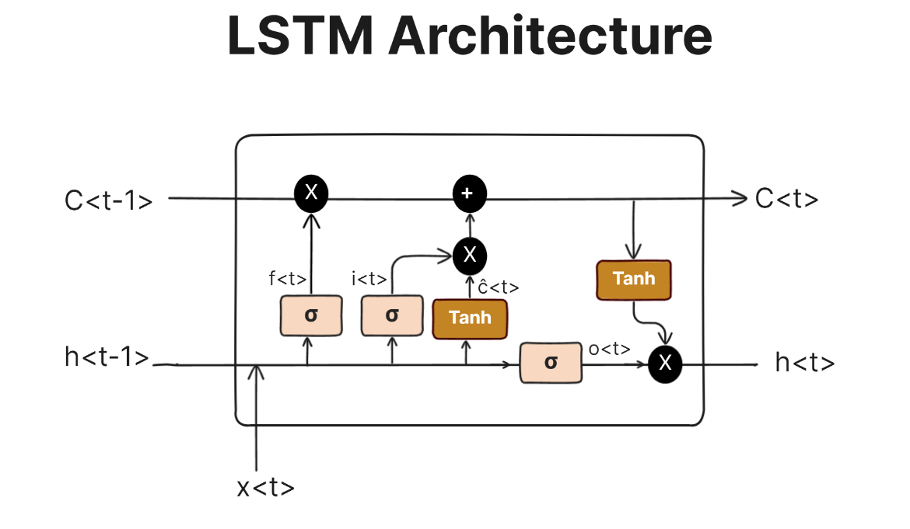

I love math. Math functions describe the world that we live in. Naturally, it also describes many computer science concepts. In this essay, I would like to model coding standards as a function of multiple variables, a multivariate function, and give each variable a corresponding weight in terms of importance to capture
what we should be practicing to be better programmers. 

**Proposition 1.1: Coding Standards as a Function**
We propose that coding standards can be modeled as a function:
$$C = f(R, M, C, E, S, P)$$
where the following axioms define the parameters for this function.

## Axioms defining the variables.

**Axiom 1.1: Readability (R)**
Although readability may seem like a basic and unimportant standard, throughout my experiences, I noticed how important it is especially when I revisit past projects. When I first started coding, I didn't practice commenting on my code at all but now I understand the importance of it so my future self will understand my present self on what I was trying to do. Poor readability also increases debugging time which decreases efficiency. We will, for now, give this a high weight as it is THE foundation of effective coding practices.

**Axiom 1.2: Maintainability (M)**
An extension of readability would be maintainability. As I mentioned, good comments, good variable naming, and efficient writing code improve efficiency but it also helps with maintainability. Easy-to-work-with functions will help your coworkers go over your code more easily. Projects with high maintainability also allow developers to extend functionality minimizing the risk of breaking existing features.

**Axiom 1.3: Collaboration (C)**
Coding standards improve team synergy by ensuring consistency in code style and logic. Software Engineering is most often practiced in a team setting with many people, hence, this axiom was considered to be important.

**Axiom 1.4: Error Reduction (E)**
Practicing coding standards helps prevent common mistakes and possible vulnerabilities. There are many cases in which systems were exploited due to security reasons; we can deduce that not the best standards were practices.

**Axiom 1.5: Scalability (S)**
In terms of developing software, scalability is one of the most important concepts. Modular design must be enforced, otherwise, invested projects in later stages might have to face major rewrites.

**Axiom 1.6: Performance (P)**
Performance-focused coding standards help optimize computational efficiency. However, systems that are too focused on optimization and complexity might suffer in other areas of coding standards such as readability and maintainability. Make sure to balance it out.

## Weighting the Variables
We can now assign a weight $$w_i$$ to each axiom such that:
$$
C = w_R R + w_M M + w_C C + w_E E + w_S S + w_P P
$$
where the weights \( w_R, w_M, w_C, w_E, w_S, w_P \) sum to 1.
$$

Now obviously, this is a joke of a model. It's just a linear regression and I highly doubt that these variables have any linear relationship. Though the "Axioms" are definitely helpful coding standards that I believe should be practiced. I had fun writing this essay!
