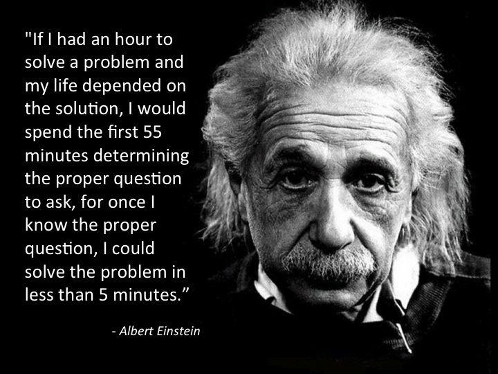

I knew the importance of communication in Software Engineering, most of which the job is commenting and doing meetings. However, I have never considered the importance of asking smart questions. I knew there was a baseline of how "smart" questions had to be but the topics discussed in this paper were entirely new concepts to me and it helped me view from a different perspective. Eric Raymond's guidelines on how to engage with the tech community will definitely help me maximize the quality of help I receive as well as the likelihood of receiving responses. 

## Why Smart Questions Matter
As I mentioned, Software engineers are required to be super collaborative with peers, clients, and other departments. Additionally, there are many online forums that they use to solve problems such as StackOverflow as well as sharing knowledge to help others. It's a very beautiful give-and-take community. Now here are a few reasons why asking the smart way is important:
1. It helps both the asker and the responder to easily understand the question, solve the question, and move on. Other people who also may have an interest in the ticket can also understand it easily.
2. Reputation can be grown in online communities. You can receive upvotes, followers, and points which will help boost your profile which then will help you with future engagements. More people will likely help others with a good reputation.
3. Formulating a smart question might lead to a deeper understanding.

## Example of a Smart Question
**Question**: How to check if a string is a substring of items in a list of strings
**Summary**: The asker wants to search for items that contain the string 'abc' in the given list.

If you take a look at the post, the original post as well as the responses has many upvotes which at a glance, implies a smart question was asked and a smart response was given. However, let's analyze more into detail why this is a smart question.

First, the asker focuses the question on a single concise topic as well as mentioning the programming language in the title which makes it easier to find people who know the language. Second, the user shows that they have attempted to solve the problem but failed to do so while showing their attempted code. This shows that the user really cares and more people will likely help. Finally, the entire post is very short but it asks the full question.

**Responses**: There are many high-quality answers to this problem. One of them was to use the code below 
```
xs = ['abc-123', 'def-456', 'ghi-789', 'abc-456']

if any("abc" in s for s in xs):
    ...
```
with the simple response of "To check for the presence of 'abc' in any string in the list:". Very straight to the point which saves many reader's time.
A common point of all these answers is that they include code examples, benchmarks, and explanations of what it does. Some go into more detail while some keep it short (especially if the question is simple enough).

## Example of a Not Smart Question
**Question**: How to Remove grey border from Facebook lightbox pop up
**Summary**: As the details of the a bove suggest, the asker is trying to remove the dark grey border that surrounds the facebook lightbox popup.

Why is this not a smart question? The question does not specify the programming language and assumes the responder to be able to detect what language they are asking for help in. The post also does not include any code snippet, no details on browser information, no showing of effort that they tried to solve the problem, and literally zero information on anything. Context is very important!

Asking questions the smart way is a skill that every software engineer should develop. It not only leads to more effective and efficient help but also develops a positive relationship with the technical community. By analyzing examples of both smart and not smart questions, this exercise helped me understand the importance of specificity, context, effort, and clarity in communication.

AI used to find a not smart question.
