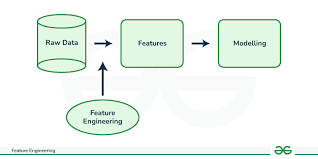

I recently worked on a project focused on predicting stock price movements using machine learning. The goal was to build a model that could analyze historical stock data and make short-term predictions about whether a stock’s price would go up or down. Stock price prediction is a classic problem in finance, but it’s tricky because markets are influenced by so many factors, historical trends, news, and even investor sentiment. To tackle this, I started by collecting and cleaning historical stock data, including prices, trading volumes, and technical indicators like moving averages and Relative Strength Index. Then, I used feature engineering to create meaningful inputs for the model, such as calculating percentage changes in price or rolling averages over specific time windows. For the model itself, I experimented with algorithms like Long Short-Term Memory networks, which are great for capturing patterns in time-series data. After training and fine-tuning the model, I evaluated its performance using metrics like accuracy and F1-score to ensure it wasn’t just memorizing the data but actually learning useful patterns.

The sample code is shown below.

```

# Create sequences for LSTM
def create_sequences(data, seq_length):
    X, y = [], []
    for i in range(len(data) - seq_length):
        X.append(data[i:i+seq_length])
        y.append(data[i+seq_length])
    return np.array(X), np.array(y)

seq_length = 60
X, y = create_sequences(scaled_prices, seq_length)

# Split into training and testing sets
split = int(0.8 * len(X))
X_train, X_test = X[:split], X[split:]
y_train, y_test = y[:split], y[split:]

# Build the LSTM model
model = Sequential()
model.add(LSTM(50, return_sequences=True, input_shape=(X_train.shape[1], 1)))
model.add(LSTM(50, return_sequences=False))
model.add(Dense(25))
model.add(Dense(1))
```
