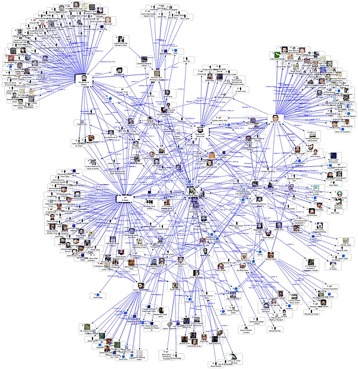

  
  
  

Before anything, I am restricted from sharing detailed information due to a signed NDA contract with the stealth startup. I will do my best to share what I can and keep this article interesting.

Last summer, I had the opportunity to intern at a stealth startup that was developing a mobile app. I was paired with this startup via UHM's Leap Start Program by showing interest and knowledge in ML. The CEO of the startup gave me a chance and I took it.
Besides the CEO himself, there was only one other ML engineer so it was a challenge to progress but through many hours, research, and communication with my other ML fellow, we made it through.

One of the two projects I worked on is a feature called "People you may know" (PYMK) as you may know from existing social media apps such as Facebook. In a nutshell, it finds other users that you might have some connections with and recommends the user to you
to connect with. I can not share much due to my NDA but I can say that I've fine-tuned existing trained ML Models and learned many AWS services for the ML model to be deployed on the app.

I DEFINITELY can NOT share any code otherwise I will get sued. Thanks for understanding.

As the Fall semester started, the startup underwent a test (not sure if it was Alpha or Beta) and is preparing to launch its official app sometime soon.

You can join the waitlist here [Bayze](https://bayze.com/).
