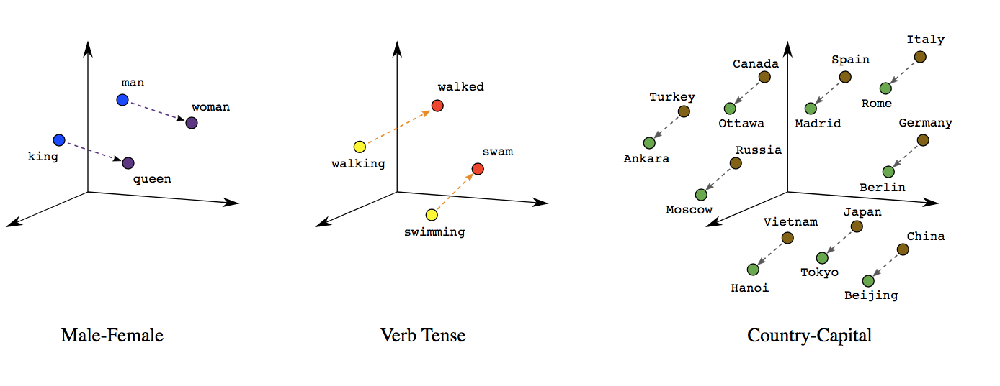
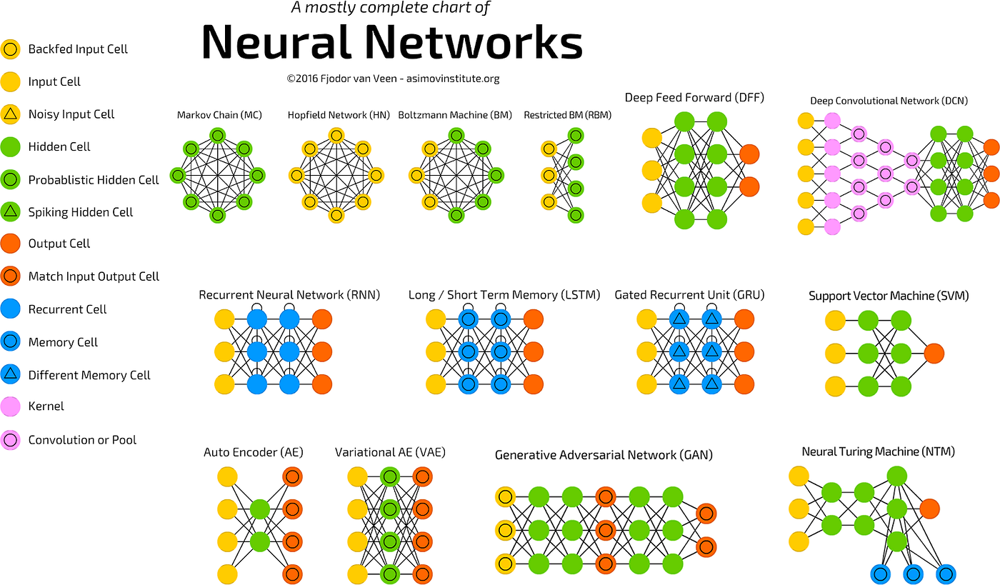

  
  
  

During my internship, I worked on a project focused on analyzing customer feedback, 
specifically through sentiment analysis. The goal was to fine-tune a pretrained model 
that could automatically determine the sentiment of customer reviews. Sentiment analysis 
is basically a way to figure out whether a piece of text is expressing a positive, negative, 
or neutral opinion. To do this, we start by cleaning and prepping the text, removing irrelevant words, 
breaking the text into manageable parts, and making sure it's ready for the model. 
Then, we use techniques like TF-IDF or word embeddings to turn the text into numbers that the 
machine can understand. The model itself is often based on deep learning, like using RNNs or even transformers, 
which are trained on a bunch of labeled data to get good at making these predictions. 
Once the model is fine-tuned, it's deployed through cloud services like AWS to handle real-time 
analysis on new reviews that come in. 

Unfortunately, I can’t share too much about the specific product due to the NDA, but the experience really helped me understand 
how these models are applied in real-world situations and how cloud platforms make it possible to scale and deploy them.
